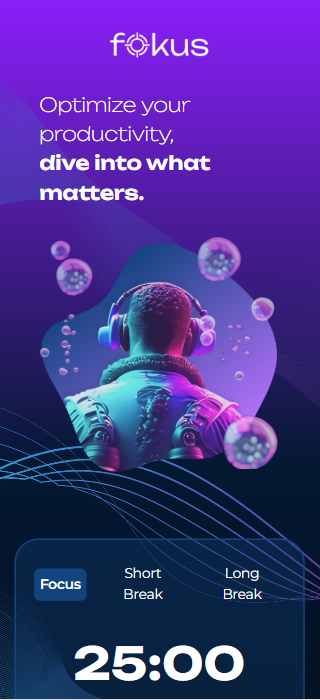

# Fokus

This web application was built as part of the Alura course **JavaScript: manipulating elements in the DOM**. It follows the course content with adaptations and enhancements.

## ✨ Project Overview
**Fokus** is a Pomodoro-style timer application that allows users to boost productivity by working in focused intervals with short and long breaks in between.

## 🌐 Live Demo
Explore the application live at: [Fokus](https://fokus-tau-rouge.vercel.app/)


## 🖼️ Preview


## 🔨 Project Features
- Timer for focused work intervals, short breaks, and long breaks.
- Dynamic text, styles, and attributes updated based on user interactions.
- Interactive buttons to switch between different modes.
- Integrated audio feedback for play, pause, and timer completion.
- Clean and user-friendly interface.

## ✅ Technologies Used
- **HTML**: For structuring the application’s content.
- **CSS**: For styling and layout, ensuring a visually appealing design.
- **JavaScript**: For dynamic interaction, including:
  - **DOM manipulation**: Updating styles, attributes, and text dynamically.
  - **Audio integration**: Playing sounds for user feedback.

## 📂 Project Structure
The project is organized into a clear folder structure:

```bash
├── index.html             # The main HTML file providing the structure of the app
├── styles.css             # Contains all styles for the application
├── app/                   # Directory for JavaScript files
│   ├── script.js          # Main JavaScript file for core functionality
├── img/                   # Directory for storing image assets
├── sounds/                # Directory for storing audio files
```

## 🚀 Deployment
The project was deployed using **Vercel**, ensuring fast and reliable hosting.
